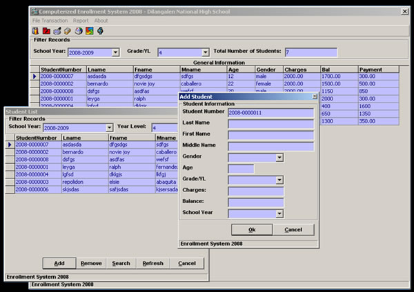



## Computerized Enrollment System

### Description

This is Computerized Enrollment System Version 1... Easy to use and easy to edit codes..
 
### More Info
 
noooo

nooo

             |
---                |---
**Submitted On**   |2008-01-19 17:31:26
**By**             |[ralph f\. leyga](https://github.com/Planet-Source-Code/PSCIndex/blob/master/ByAuthor/ralph-f-leyga.md)
**Level**          |Intermediate
**User Rating**    |3.6 (18 globes from 5 users)
**Compatibility**  |VB 3\.0, VB 4\.0 \(16\-bit\), VB 4\.0 \(32\-bit\), VB 5\.0, VB 6\.0
**Category**       |[Databases/ Data Access/ DAO/ ADO](https://github.com/Planet-Source-Code/PSCIndex/blob/master/ByCategory/databases-data-access-dao-ado__1-6.md)
**World**          |[Visual Basic](https://github.com/Planet-Source-Code/PSCIndex/blob/master/ByWorld/visual-basic.md)
**Archive File**   |[Computeriz2101612122008\.zip](https://github.com/Planet-Source-Code/ralph-f-leyga-computerized-enrollment-system__1-70089/archive/master.zip)

### API Declarations

nooo

